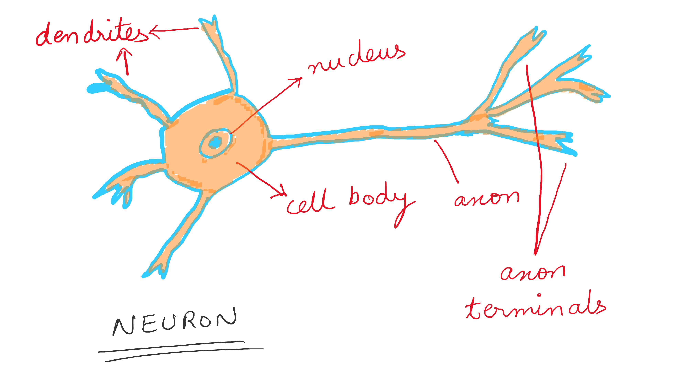
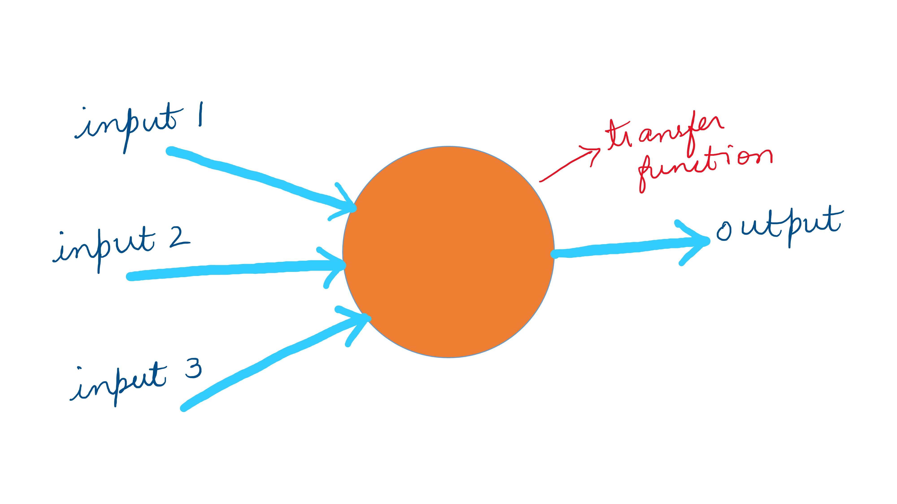
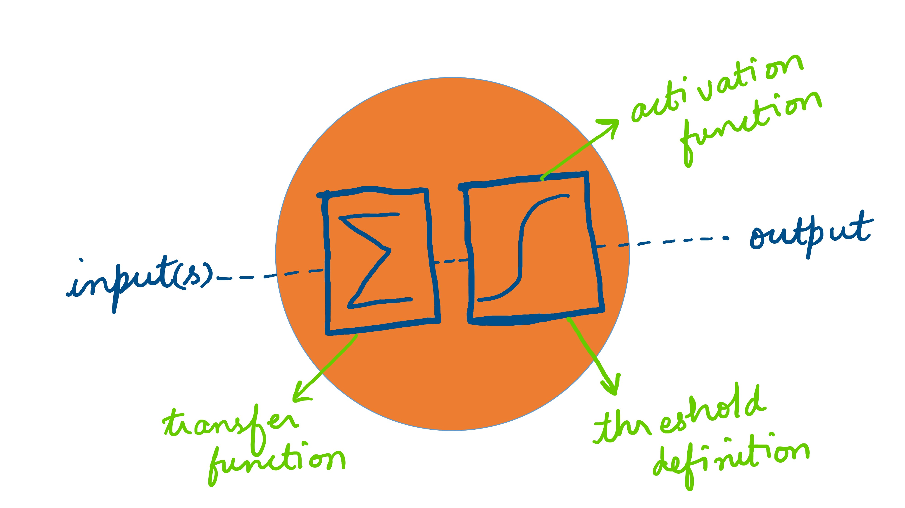
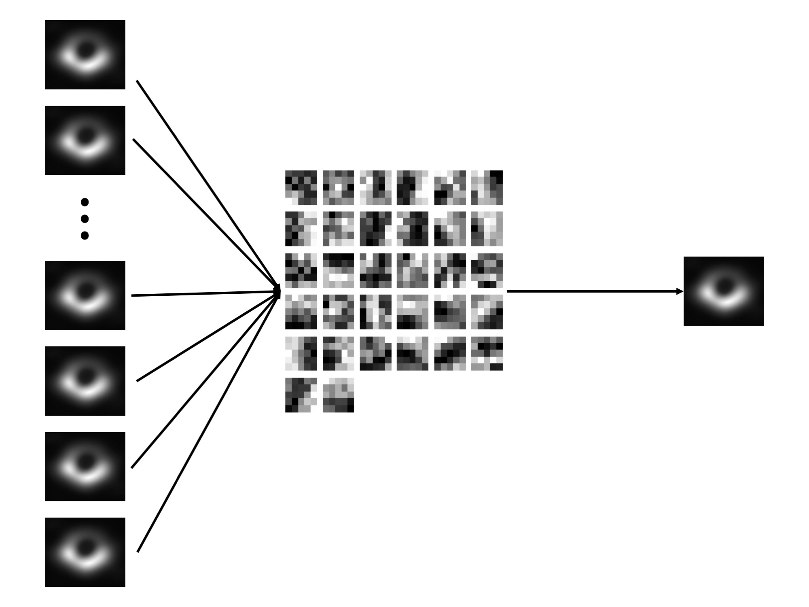
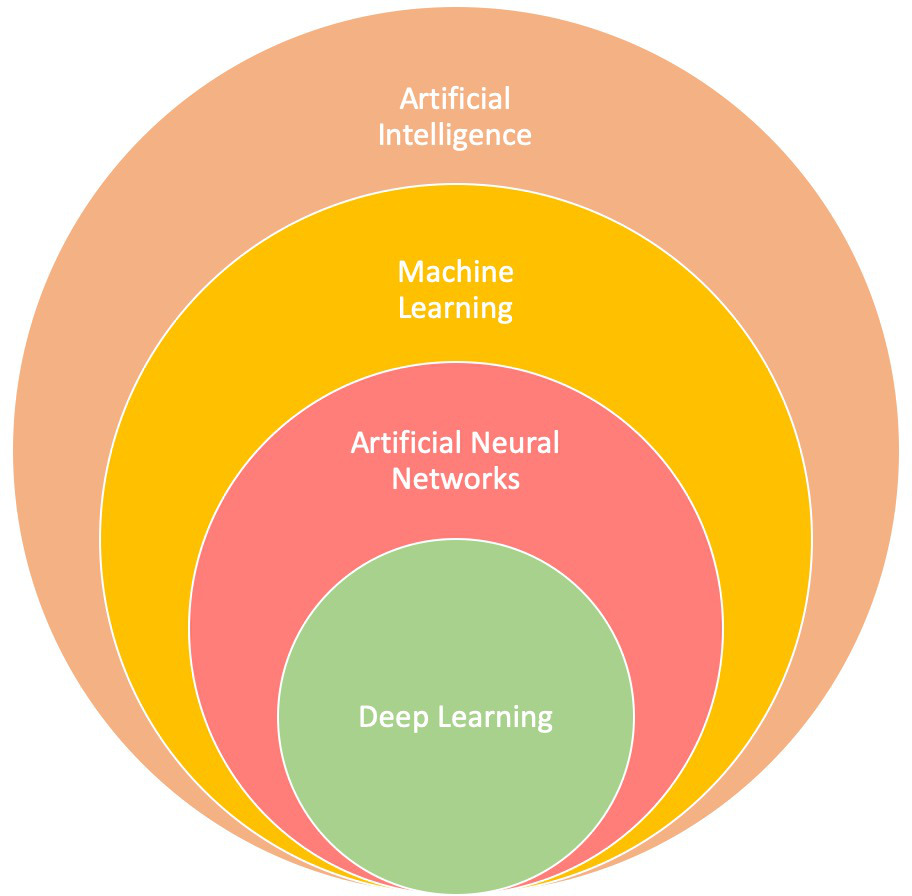

Neural Networks and Deep Learning
========================================================
author: Shaurya Jauhari, Mora Lab, Guangzhou Medical University. (Email: shauryajauhari@gzhmu.edu.cn)
date: 2019-09-06 15:17:37
autosize: true

Neural Networks
========================================================

Neural Networks (Contd.)
========================================================

Neural Networks (Contd.)
========================================================

Deep Learning
========================================================

Deep Learning (Contd.)
========================================================

Deep Learning : Essential Characteristics
========================================================

- Hierarchical Learning
    - Self evolution and feature extraction  
- Predominantly employed for **multimedia mining**  
- **Deep Learning** is a kind of **machine learning** that focuses on **neural networks**.

