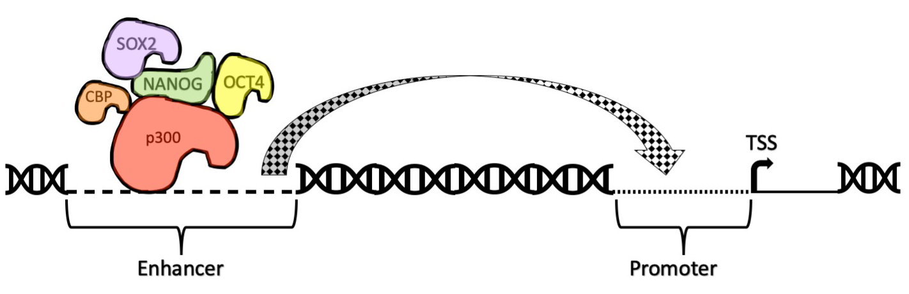

```{r setup, include=FALSE}
knitr::opts_chunk$set(echo = TRUE, comment = NA)
```
***

<p>Welcome to the second workshop in the series of **Machine Learning Fundamentals**. In this session, we shall explore the theory of **Decision Trees** and scale it to the broader concept of **Random Forests**. Decision trees epitomize the divide and conquer strategy to accomplish classification tasks (although they could also be implemented for regression chores as well) [@Quinlan1986, @Rokach2005]. From the previous session on **Logistic Regression**, you may recall that if the response variable is catergorical in nature (factors in R), we aim classification, or else, if the response variable is continuous, it denotes regression. Classification and regression methodologies are both categorized under supervised machine learning. The theme of machine learning was realized in 1950s and since then, coupled with the data deluge and upheaval in computational prowess, has exhibited stronghold in data analysis domain (See Figure 1).</p>


Random forests enlighten on the dogma of democracy, i.e. *majority wins*. Decision Trees are rudimentary classification algorithms that, at a low-level, are synonymous to *if-then* conditional statements in programming languages. They follow the strategy of iterative recursion, and intuitively the leaf nodes hold the final verdict. The highest aggregate from all leaf nodes (terminals) is graded as the output of that decision tree.  

In this module, we shall delve into creation of basic decision trees to have an understanding of it. For the purpose, we shall load the package **party** and make use of the function **ctree()** to calculate and analyze decision trees.  


```{r Loading *party* package}
install.packages("party", dependencies = TRUE, repos = "https://mirrors.tuna.tsinghua.edu.cn/CRAN/")
library(party)

```

#####Dataset Profile

Let us now, pick up a dataset. The dataset pertains to the soft computation of the **enhancer prediction** module in bioinformatics. We certainly take into cognizance the biological implications about enhancer regions (See Figure 2).   
Certain known classes of proteins/ cis-regulatory elements called Transcription Factors (TFs) and Transcription Co-Activators (TCoAs) are programmed to bind to regions in the genome called *Enhancers*, that remotely orchestrate the phenomena of gene regulation. They are at a distal location to the *Promoters*, regions associated with genes and respective Transcription Start Sites (TSS). On stimulus from TFs, the enhancer and promoter sequences reciprocate and actuate the transcription machinery.  

  For use in this session, we have chosen the dataset from the study, "Genome-wide mapping of p300 binding in resting and activated human naïve and memory CD8 T cells", sample dataset deposited to GEO labeled GSM2445787. The dataset is originally available as a WIG file. At first, it is converted to BED and is then subsequently cleaned for our use as illustrated in the following code^[See Notes, 3].

```{r Dataset Processing}
mydata_enhancers <- read.csv("./GSM2445787.bed", sep = '\t', header = FALSE)

## We choose to incorporate only those peaks with occurence of 1 and above. Additionally, a column for "Class" has been added that uniformly holds the value "Enhancer" as all the peaks correspond to p300 bindings in the genome. Finally, we have also pruned the dataset for columns on peak ids and frequencies.

mydata_enhancers <- mydata_enhancers[mydata_enhancers$V5 > 0,]
mydata_enhancers <- mydata_enhancers[,c(1,2,3)]
mydata_enhancers$Class <- "Enhancer"
colnames(mydata_enhancers) <- c("Chrom", "Start", "End", "Class")

## We have hit a roadbloack here! In order to execute for decision trees, given the dataset, we shall always have a node that is having two attributes minimum. Since fields "Chrom", "Start", and "End" are intimately related, we'll need "Chrom" as default attribute, alongwith "Start" or "End" or both. There are two ways to solve this problem. First is to have a tree with two attributes at each node. Second way could help by, (i) having the file in sorted order by chromosome names, (ii) and then setting up a new column indicating cumulative "Start" and "End" extremities. 

## Let's try the second way out.
## It's better to confirm if we have the data in sorted order by chromosomes.

mydata_enhancers_sorted_chrom_names <- mydata_enhancers[with(mydata_enhancers, order(Chrom)), ]

## Cool!

```



To add to the negative class data, we consider regions that are non-enhancers. Under this category, we include some random background data as well as equal number of TSS. The reason for soing such is because enhancer sites are lower in number in comparison to the promoter sites [@Rajagopal2013]. So, in order to normalize our example dataset we plan such a structuring.


#####Notes  
  1.  The authors [@Rajagopal2013] construed p300 (a transcription co-activator) binding sites overlapping DNase-I hypersentitive sites and distal to annotated transcription start sites (TSS) as active p300 binding sites representative of enhancers.
  2. Clusters with presence or absence of H3K36me3 were hypothesized to represent genic and inter-genic enhancers respectively.
  3. While pre-processing the genomic ranges data if you need to convert WIG file to BED file, you may want to refer to BEDOPS -> wig2bed() function. This is available as a command line utility.

P.S. During intermediary partitioning, if the node has the lowest Gini Index, it becomes leaf node. That will most likely be the case when all remaining non-root nodes have been exhausted, checking for impurity score.

All workshop study material is available at my github page [@mygithub].


# References
