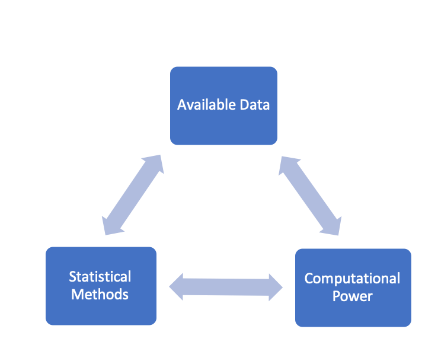

```{r setup, include=FALSE}
knitr::opts_chunk$set(echo = TRUE)
```
***

<p>Welcome to the second workshop in the series of **Machine Learning Fundamentals**. In this session, we shall explore the theory of **Decision Trees** and scale it to the broader concept of **Random Forests**. Decision trees epitomize the divide and conquer strategy to accomplish classification tasks (although they could also be implemented for regression chores as well) [@Quinlan1986, @Rokach2005]. From the previous session on **Logistic Regression**, you may recall that if the response variable is catergorical in nature (factors in R), we aim classification, or else, if the response variable is continuous, it denotes regression. Classification and regression methodologies are both categorized under supervised machine learning. The theme of machine learning was realized in 1950s and since then, coupled with the data deluge and upheaval in computational prowess, has exhibited stronghold in data analysis domain.</p>

***
<p>

</p>
***

Decision Trees are rudimentary classification algorithms that, at a low-level, are synonymous to *if-then* conditional statements in programming languages. They follow the strategy of iterative recursion, and intuitively the leaf nodes hold the final verdict. The highest aggregate from all leaf nodes (terminals) is graded as the output of that decision tree.

In this module, we shall delve into creation of basic decision trees to have an understanding of it. For the purpose, we shall load the package **party** and make use of the function **ctree()** to calculate and analyze decision trees.


```{r Loading *party* package}
install.packages("party", dependencies = TRUE, repos = "https://mirrors.tuna.tsinghua.edu.cn/CRAN/")
library(party)

```

P.S. During intermediary partitioning, if the node has the lowest Gini Index, it becomes leaf node. That will most likely be the case when all remaining non-root nodes have been exhausted, checking for impurity score.

All workshop study material is available at my github page [@mygithub].


# References
