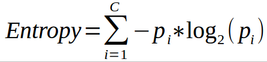

Decision Trees and Random Forests: A Machine Learning Perspective
========================================================
author: Shaurya Jauhari, Mora Lab, GMU. (Email: shauryajauhari@gzhmu.edu.cn)
date: 2019-06-14
autosize: true

RoadMap
========================================================

- Introduction
- General Concepts
  - **B**ootstrapping
  - **Agg**regating
  - **Bagg**ing
  - Classification and Regression Trees (CART)
- Decision Trees
- "Best" Split
  - Gini Index
- Random Forests
- Packages: *rpart*, *party*, *randomForest*

Decision Trees
========================================================

- **Cleave data** into smaller portions to elicit patterns that aid prediction | Recursive Partitioning
- **Logical structures** hence represented can be construed without any *a-priori knowledge*.

"Best" Split
========================================================

- Underperformance noted with nominal/ numerical data
- Which attribute to select for tree partitioning?
- Measures of Purity:**Information Gain**, **Gain ratio**, **Chi-Squared statistic**, etc.
- $Information Gain = Entropy_{Old} - Entropy_{New}$

- Gini Index
- Only Binary classification problems

Gini Index
========================================================
- Calculated for **each node**
- What's the Root node?
-  First calculate how well each feature classifies data
  - Outlook -> Play Tennis; Temperature -> Play Tennis; Humidity -> Play Tennis; Wind -> Play Tennis
  

Gini Index (Contd ...)
========================================================
- Perform such quantitation for all features
- "Impure"
  - None of the leaf nodes denote 100% Yes or 100% No for Play Tennis
- Compare impurities
  - less the better
- $$Gini Impurity_{Sunny}$$ = 1 - (the probability of "yes")^2 - (the probability of "no")^2
  - $1 - (2/(2+3))^2 - (3/(2+3))^2$
  - **0.52**
- Calculate the same for *Rain* and *Overcast*

Gini Index (Contd ...)
========================================================
- Further, calculate the same for each class/ level of the remaining features (**Temperature**, **Humidity**, and **Wind**)
- Classification Counts could be different for different features. That's OK!

Gini Index (Contd ...)
========================================================
- Next is, *Weighted average calculation* for a each feature
  - $$Gini Impurity _{Outlook}$$ = (classifications in the leaf node/total classification in the feature) * $$Gini Impurity_{Sunny}$$ + (classifications in the leaf node/total classification in the feature) * $$Gini Impurity_{Rain}$$ + (classifications in the leaf node/total classification in the feature) * $$Gini Impurity_{Overcast}$$

Gini Index (Contd ...)
========================================================
  - $$Gini Impurity _{Outlook}$$ = (5/5+5+4)* 0.52 + (classifications in the leaf node/total classification in the feature) * $$Gini Impurity_{Rain}$$ + (classifications in the leaf node/total classification in the feature) * $$Gini Impurity_{Overcast}$$

Gini Index (Contd ...)
========================================================
- Eventually impurities for each feature will be compared
  - one with least impurity gets to be the root node/ *splitting attribute*
- What about intermediary nodes?
  - Still not pure.
  - iterative process till *purity* is acheived.
- Check the leaf nodes of the root node with the protocol for Gini Index calculation
  - Now using the non-root node features

Gini Index (Contd ...)
========================================================
- For features with **continuous/ numerical data**
  - sort the data
  - calculate average of every two values
  - Gini index will be calculated on this average
      - Weight < 100 kg.; Height < 6 ft., etc.
  - Subsequently, these Gini indexes shall be the basis for split

Gini Index (Contd ...)
======================================================== 
- For features with **ranked data**
  - calculate Gini index for all ranks
  - ignore *last rank*
  
- For features with **multiple-choice/ nominal data**
  - calculate Gini index for each choice as well as each possible combination
  - ignore *combination of all choices*
  
  
Take it easy!
======================================================== 
, where *c* is th total number of features/attributes.
- R Packages
  - *ineq* , ineq(data,type="Gini")
  - *DescTools* , Gini()
  - *reldist* , gini()
  - *REAT* , gini()
  - *rpart* , rpart(y~x+z, data=df, parms=list(split='gini'))

  
Central Dogma of Random Forests: "Variety" brings "Veracity"
========================================================

Random Forests: Accuracy
========================================================
- Out-of-Bag samples: Individual test cases
- *out-of-bag error*: misclassification error for these left cases
- The number of variables used per step can also be altered
  - to bring variety to the tree structure
  - dilute *biasness*
  - settings available in package functions
  - typical to consider *square of the number of variables*
  

Random Forests: Missing Data
========================================================
- Imputing missing data | data normalization
- Data: numerical/ categorical
- Idea is to make initial guess and refine it moving forward
  - Categorical: *most common class*
  - Numerical: *median value*
- Refinement:
  - compare samples similar to sample with missing data
  - Build *proximity matrix* to track similarity
      - (sample x sample) matrix
      - values in corresponding cell augmented by 1 for samples ending in a common leaf node
      - done for both cells, (row x column) and (column x row), of the matrix

Random Forests: Missing Data
========================================================
- Similarity
  - Step 1: 
      - Build random forest
      - run the dataset on all of the trees
      - construct/ update the proximity matrix
  - Step 2:
      - Divide the proximity matrix with the number of trees
      - these values are the *proximity values*/ weights to be used for making better guesses about the missing data
  - Step 3:
    - Fill in the "weighted" values to get the first "revised" dataset.
- Repeat aforementioned steps several times, till the values converge.
    

Random Forests: Missing Data (Contd...)
========================================================

- Proximity Matrix -> Distance Matrix -> Heatmap -> MDS Plot
- (TP,TN,FP,FN) -> Confusion Matrix -> Accuracy -> ROC Curve

Thank You
========================================================

- Off to the exercises now.
- https://github.com/shauryajauhari/Machine_Learning/
